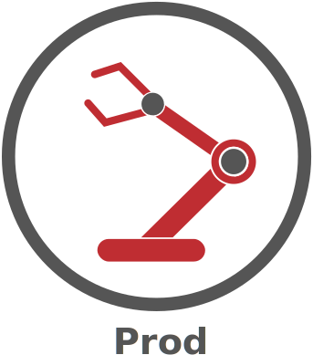

<h1 align="center">
  
</h1>
<h2 align="center">
  
</h2>
<p align="center">:factory:(:robot:, :construction_worker_man:|:construction_worker_woman:) =  :rocket:</p>
<div align="center">

[Concept](#concept)&nbsp;&nbsp;&nbsp;|&nbsp;&nbsp;&nbsp;[Usage](#usage)&nbsp;&nbsp;&nbsp;|&nbsp;&nbsp;&nbsp;[Download](#download)&nbsp;&nbsp;&nbsp;|&nbsp;&nbsp;&nbsp;[Configuration](#configuration)&nbsp;&nbsp;&nbsp;|&nbsp;&nbsp;&nbsp;[Examples](#examples)&nbsp;&nbsp;&nbsp;|&nbsp;&nbsp;&nbsp;[Support](#support)&nbsp;&nbsp;&nbsp;

<p><br></p>
</div>

**Prod** is a cross-platform tool for consistently delivering your project by yourself from development to production as fast as possible.  It is a fast, CI/CD agnostic, composable and consistent tool that improves the edit-compile cycle time of developers from dependencies fetching to releasing.

The key features of Prod are:
- **Consistent**: Run in containers, like linux containers, virtual machines or locally
- **Anywhere**: Laptop, CI/CD systems, servers, Linux, macOS, BSD, Windows
- **Anytime**: Deploy emergency patches while your CI/CD system is broken or too busy
- **Make CLI interface**: Keep compatibility with the [Make](https://en.wikipedia.org/wiki/Make_(software)) command interface

## :gear: Concept
To keep it simple and visual, Prod models the delivery process as a [production line](https://en.wikipedia.org/wiki/Production_line):

- workstation: an executable focusing on a specialized task (e.g. compile, unit test or deploy) along with its configuration describing its inputs, outputs and container; implemented in the programming language that you feel comfortable
- production line: orchestrate the order workstations are launched
- conveyor: launch and pass inputs and outputs (files/variables) between workstations
- bot (coming soon): pre-automated task that workstations can trigger

Conveyors are plugins based, currently supporting:
- local: run directly on the machine outside containers
- docker: run in Docker containers
- gitlab: run in Gitlab CI

## :construction_worker: Usage
Run all:
```shell
$ prod
```
Synopsis:
```shell
$ prod [options] [workstation]
$ prod [options] --cmd <command>
```

Commands:
- list: List workstations
- graph: Draw a graph of the production line
- generate: Convert the configuration into native conveyor configuration (e.g. .gitlab-ci.yml, Jenkinsfile)

See also `prod --help`.

## :link: Download
<div align="left">
<b>Latest</b>&nbsp;&nbsp;&nbsp;&nbsp;&nbsp;&nbsp;Linux&nbsp;&nbsp;<a href="https://github.com/sysprod/prod/releases/latest/download/prod_linux_amd64">64-bit</a>
&nbsp;&nbsp;
&nbsp;&nbsp;Windows&nbsp;&nbsp;<a href=https://github.com/sysprod/prod/releases/latest/download/prod.exe>64-bit</a>
&nbsp;&nbsp;
&nbsp;&nbsp;macOS&nbsp;&nbsp;<a href=https://github.com/sysprod/prod/releases/latest/download/prod_darwin_amd64>64-bit</a>

<b>v1.0</b>&nbsp;&nbsp;&nbsp;&nbsp;&nbsp;&nbsp;&nbsp;&nbsp;&nbsp;&nbsp;Linux&nbsp;&nbsp;<a href="https://github.com/sysprod/prod/releases/download/v1.0/prod_linux_amd64">64-bit</a>
&nbsp;&nbsp;
&nbsp;&nbsp;Windows&nbsp;&nbsp;<a href=https://github.com/sysprod/prod/releases/download/v1.0/prod.exe>64-bit</a>
&nbsp;&nbsp;
&nbsp;&nbsp;macOS&nbsp;&nbsp;<a href=https://github.com/sysprod/prod/releases/download/v1.0/prod_darwin_amd64>64-bit</a>
</div>

More OS/architectures available on request:
- **Linux**: 386, arm, arm64, mips, mips64, mips64le, mipsle, ppc64, ppc64le, riscv64, s390x
- **Windows**: 386, arm
- **macOS**: 386, arm, arm64
- **Android**: 386, amd64, arm, arm64
- **Dragonfly**: amd64
- **FreeBSD**: 386, amd64, arm, arm64
- **NetBSD**: 386, amd64, arm, arm64
- **OpenBSD**: 386, amd64, arm, arm64
- **Plan9**: 386, amd64, arm
- **Illumos**: amd64
- **Solaris**: amd64
- **Aix**: ppc64
- **Js**: wasm

## :wrench: Configuration
Keeping it as simple as possible, `prod.yml` describes a production line in two sections:
- workstations: list of workstations
- production\_lines: list of production lines (e.g. dev and production)

### Configuration example
- Tiny build-test-deploy configuration:

```yaml
workstations:
  build:
    description: "Build the project"
    container:
      image: "ubuntu"
  test:
    description: "Test the project"
    container:
      image: "ubuntu"
  deploy:
    description: "Deploy the project"
    container:
      image: "ubuntu"

production_lines:
  default:
    - from:
        - build
      to:
        - test

  production:
    - from:
        - build
      to:
        - test

    - from:
        - test
      to:
        - deploy
```

- Python application: [prod.yml](./prod.yml)

### Variables

Prod replaces variables with their values when running a production line.

Three types of variables:
- ${env.NAME}: read the value from the system environment variables
- ${var.NAME}: read the value from "variables" blocks and can be called from other parts of the configuration
- ${conveyor.NAME}: read the value from the conveyor

Built-in Conveyor variables:
- ${conveyor.PRODCACHE}: return the path of the cache of the conveyor

### Conveyor configuration

Optional configuration specific to a convoyor containing user's configuration like a token.

Its location follows the [XDG Standard](https://specifications.freedesktop.org/basedir-spec/basedir-spec-latest.html): <XDG_PATH>/sysprod/prod/user.yml

|  | Linux and BSD | Mac | Windows |
| ---: | :---: | :---: | :---: |
| `XDG_CONFIG_DIRS` | [`/etc/xdg`] | [`/Library/Application Support`] | `%PROGRAMDATA%` |
| `XDG_CONFIG_HOME` | `~/.config` | `~/Library/Application Support` | `%APPDATA%` |

#### Local
None

#### Docker
None

#### Gitlab

```yaml
conveyors:
  gitlab:
    default:
      api:
        token: "DkfkEUQy_HLvSxvWV7eq"
```

Here, the configuration is named `default` which is loaded by default without using `--conveyor-config`.

- token: the Gitlab personal access token to connect to the Gitlab API, refer to the [Gitlab's documentation](https://docs.gitlab.com/ee/user/profile/personal_access_tokens.html)

## :hammer_and_wrench: Examples
### Python application
1. Clone this repository
```shell
git clone https://github.com/sysprod/prod.git
cd prod
```

2. List the available workstations of this Python project
```shell
prod --cmd list
```

3. Graph the delivery process into a PNG picture
```shell
prod --cmd graph | dot -Tpng -o graph.png
```

4. Build locally the project up to "unit"
- Have a Python virtual environment created, for example `python -m venv venv`
- Activate your Python virtual environment, for example for Linux `source venv/bin/activate`
- Build up to "unit"
```shell
prod unit
```

5. Build in Docker the project up to "unit"
```shell
prod --conveyor docker unit
```

6. Generate `.gitlab-ci.yml`
```shell
prod --conveyor gitlab --cmd generate
```

## :chains: Support
Github issue and feature requests are welcome!

## :hearts: Credits
- Base logo by <a href="https://pixabay.com/fr/users/janjf93-3084263/?utm_source=link-attribution&amp;utm_medium=referral&amp;utm_campaign=image&amp;utm_content=2126877">janjf93</a> from <a href="https://pixabay.com/fr/?utm_source=link-attribution&amp;utm_medium=referral&amp;utm_campaign=image&amp;utm_content=2126877">Pixabay</a>
- Demo with [TOIlet](http://caca.zoy.org/wiki/toilet), [lolcat](https://github.com/busyloop/lolcat), [Terminalizer](https://terminalizer.com)
- Icons by [Font Awesome](https://github.com/FortAwesome/Font-Awesome)
